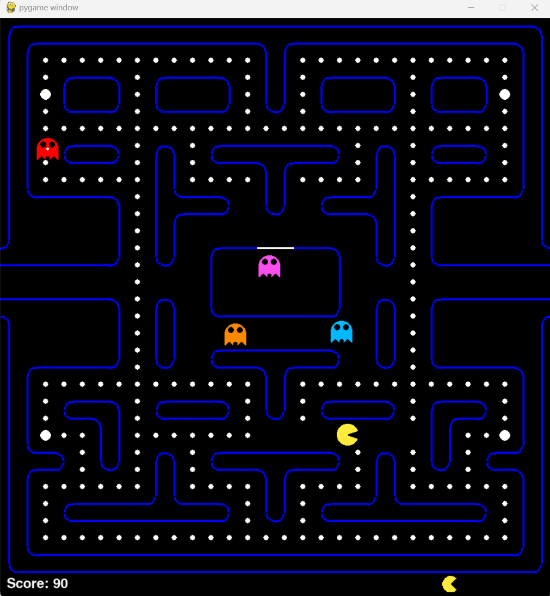

# Pac-Man Python Clone
## Project Overview
This project is based off of @LeMasterTech on YouTube's PyGame Pac-Man clone. It uses a 
grid style Pac-Man board layout as well as individual algorithms for each of the ghosts. This
iteration builds off of the tutorial including WASD support in addition to arrow keys for Pac-Man
movement, A smaller screen size, and support for multiple levels in the future.

